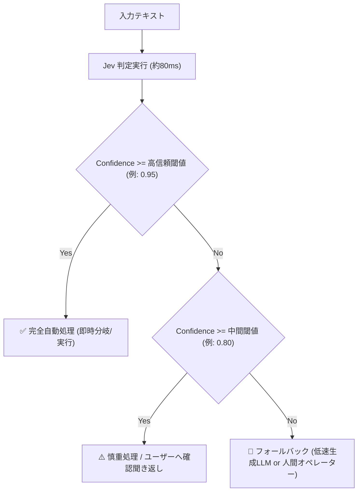

# Jev 設計・実装パターン & フォールバック設計リファレンス

## 1. Jev の基本呼び出しパターン (擬似SDK仕様)

TypeSafe AI Jev は、入力テキストと定義スキーマ（型）を受け取り、判定値と確率（確信度）を返します。

```typescript
export interface JevDecision<T> {
  value: T;              // スキーマに合致した厳格な型定義値
  confidence: number;     // 0.00 〜 1.00 (校正済み確率)
  durationMs: number;     // 実行レイテンシ (通常 70〜150ms)
}
```

## 2. 確信度（Confidence）に基づく3段階フォールバック設計

Jev最大の強みは「校正された確信度（Calibrated Probability）」です。これを利用して堅牢なアーキテクチャを構築します。



### 閾値設定の目安
- **高リスク処理（セキュリティ、決済、アカウントBAN）**:
  - `Confidence >= 0.98` のみ自動処理。未満は人間確認または詳細LLM判定。
- **中リスク処理（問い合わせトリアージ、コンテンツ分類）**:
  - `Confidence >= 0.90` で自動処理。未満は確認ステップへ。
- **低リスク処理（UIおすすめ、関連度ソート）**:
  - `Confidence >= 0.70` でそのまま活用。
